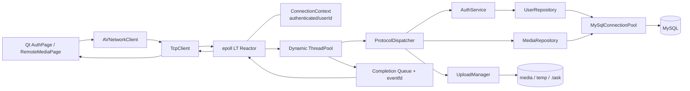

# AVProject MySQL 与用户系统 V1 开发计划

> 状态：待开发  
> 用途：交给后续 Agent 按阶段实施  
> 源码基线：以当前 `AVClient`、`AVServer` 源码为准  
> 允许范围：实现本计划定义的数据库与用户闭环，并维护相关文档和测试  
> 禁止范围：RTMP、推荐系统、对象存储、业务无关重构、播放器/录制器功能扩展

## 1. 目标与完成定义

本版本把当前“匿名共享媒体目录”演进为“有用户身份和媒体归属的单机媒体服务”，但保留现有文件传输、断点续传、Reactor、线程池和本地文件存储架构。

V1 必须形成以下完整闭环：

```text
客户端连接服务端
    -> 注册账号
    -> 登录账号
    -> 服务端把 userId 绑定到当前 ConnectionContext
    -> 登录用户上传视频
    -> 上传完成后生成带 ownerUserId 的 MySQL media 记录
    -> 所有登录用户可以查看“公共媒体”
    -> 当前用户可以查看“我的上传”
    -> 用户仍可使用现有下载、播放和断点续传能力
```

完成标准不是“能连接 MySQL”或“登录返回成功”，而是以下条件全部满足：

- 注册、登录使用真实 MySQL 数据，不再固定返回成功；
- 密码只以安全哈希形式保存，不保存明文或 MD5；
- MySQL 查询和密码校验不在 Reactor 线程执行；
- worker 不直接访问或修改 `ConnectionContext`；
- 登录结果通过 completion queue 回到 Reactor，由 Reactor 更新连接身份；
- 未登录用户不能查看媒体、上传或下载；
- 上传任务同时区分 `ownerUserId` 和 `activeOwnerConnectionId`；
- 用户不能恢复其他用户的上传任务；
- 上传完成后，磁盘文件和 MySQL 媒体记录能够恢复到一致状态；
- 公共媒体与“我的上传”返回结果正确；
- 客户端现有 `*.upload.json`、`*.download.json` 保留；
- 服务端现有 `.task` 和 `.part` 机制保留；
- 客户端、服务端能够正常构建，现有 Ping、上传、下载、断点恢复不回退。

## 2. V1 范围

### 2.1 必须实现

- MySQL 配置加载与启动检查；
- 有界数据库连接池；
- `users` 表和 `media` 表；
- 用户注册；
- 用户登录；
- 密码安全哈希与校验；
- 每连接认证状态；
- 未认证访问控制；
- 上传任务绑定用户；
- 上传完成写入媒体元数据；
- 公共媒体列表；
- 我的上传列表；
- 列表分页；
- 旧 `media` 文件的一次性、幂等目录导入；
- 旧 `.task` 任务的兼容读取或明确迁移；
- 数据库异常、连接关闭和陈旧 completion 的处理；
- 自动化测试、人工验收流程及文档。

### 2.2 明确不做

- RTMP 推流、拉流和 Nginx-RTMP；
- 点赞、评论、关注、推荐、标签和行为记录；
- 管理员后台、审核系统；
- 视频删除、改名、编辑、转码、封面生成；
- Redis、消息队列、微服务；
- COS/OSS 对象存储；
- SQLite 替换客户端 JSON；
- MySQL 保存视频 BLOB；
- 多设备长期登录和复杂 Token 刷新；
- 忘记密码、短信、邮件验证码；
- 对现有播放器和录制器进行无关重构；
- 把全部协议升级为 JSON、Protobuf 或 HTTP；
- 在本版本解决现有协议的网络字节序和跨架构兼容问题；
- 把 TLS 混入本次开发。TLS 作为公网正式账号使用前的后续强制项。

## 3. 当前源码基线

后续 Agent 开始编码前必须重新阅读以下源码，不得仅依据本文猜测：

### 3.1 客户端

- `AVClient/main.cpp::main`
- `AVClient/MainWindow.cpp::MainWindow`
- `AVClient/pages/SettingsPage.cpp::slotConnectClicked`
- `AVClient/pages/RemoteMediaPage.cpp`
- `AVClient/modules/network/AVNetworkClient.cpp::sendLogin`
- `AVClient/modules/network/AVNetworkClient.cpp::onPacketReceived`
- `AVClient/modules/network/TcpClient.cpp`
- `AVClient/modules/network/UploadTaskStore.cpp`
- `AVClient/modules/network/DownloadTaskStore.cpp`
- `AVClient/modules/network/av_protocol.h`
- `AVClient/AVClient.pro`

### 3.2 服务端

- `AVServer/src/main.cpp::main`
- `AVServer/src/EpollServer.cpp::start`
- `AVServer/src/EpollServer.cpp::parseFrames`
- `AVServer/src/EpollServer.cpp::submitBusinessTask`
- `AVServer/src/EpollServer.cpp::handleCompletionEvent`
- `AVServer/include/EpollServer.h::CompletedTask`
- `AVServer/include/ConnectionContext.h`
- `AVServer/src/ProtocolDispatcher.cpp::isBusinessPacket`
- `AVServer/src/ProtocolDispatcher.cpp::dispatch`
- `AVServer/src/ProtocolDispatcher.cpp::handleLogin`
- `AVServer/src/UploadManager.cpp`
- `AVServer/src/MediaManager.cpp::buildMediaListPayload`
- `AVServer/src/DownloadManager.cpp`
- `AVServer/include/av_protocol.h`
- `AVServer/Makefile`

### 3.3 当前必须尊重的事实

- `ConnectionContext` 由 Reactor 线程拥有，worker 不得持有其裸指针；
- 每连接最多一个在途业务任务，后续完整帧保留在 `receiveBuffer`；
- worker 结果通过 completion queue 和 `eventfd` 返回 Reactor；
- `connectionId` 用来过滤连接关闭或 fd 复用后的陈旧结果；
- 当前登录不在 `isBusinessPacket` 列表中，因此固定登录逻辑直接在 Reactor 执行；
- 当前 `handleLogin` 没有读取请求字段，也没有查询用户；
- 当前媒体列表通过扫描 `media` 目录产生；
- 当前上传以 `.part` 保存数据，以 `.task` 保存服务端恢复状态；
- 当前客户端以 `*.upload.json` 和 `*.download.json` 保存本地恢复状态；
- 当前下载按服务端文件名定位文件；V1 暂时保留这一行为；
- 当前协议头在客户端和服务端各有一份，修改时必须同步并验证完全一致。

## 4. 目标架构



职责边界：

- Reactor：socket、连接生命周期、认证状态应用、发送队列；
- worker：SQL、密码哈希校验、目录/文件业务、协议业务；
- `ConnectionContext`：当前 TCP 连接的身份，不作为跨线程共享对象；
- MySQL：用户和正式媒体元数据；
- `.task`：V1 服务端上传任务恢复；
- `.part`：已接收的真实上传字节；
- 客户端 JSON：本机路径、缓存路径和本机恢复状态。

## 5. 核心设计决策

### 5.1 使用 MySQL，不使用 SQLite 作为服务端共享数据库

采用方案：服务端通过本机或私网连接 MySQL，客户端不直连数据库。

原因：

- 多个 worker 需要并发查询；
- 多个客户端共享用户和媒体数据；
- 后续可把 AVServer 和数据库部署到不同实例；
- 客户端不应获得数据库账号和网络权限。

### 5.2 视频仍保存在文件系统

采用方案：`media` 保存正式视频，MySQL 保存 `storage_path` 等元数据。

原因：

- 大视频不适合作为 MySQL BLOB；
- 保留现有下载和断点续传实现；
- 后续迁移对象存储时只需替换存储层。

### 5.3 V1 不引入持久 Session

采用方案：登录成功后把身份绑定到当前 TCP 连接，断线后要求重新登录。

原因：

- 当前客户端已经是长连接；
- 可以先验证最核心的认证和权限链；
- 避免一次引入 Token 签发、刷新、撤销和多设备状态。

### 5.4 worker 只返回认证变更，不修改连接对象

采用方案：worker 返回 `AuthUpdate`，Reactor 验证 `connectionId` 后应用。

原因：

- `ConnectionContext` 可能在 SQL 执行期间被关闭；
- fd 可能被另一个客户端复用；
- 保持连接状态单线程所有权；
- 复用现有 completion queue 和 `eventfd` 模型。

### 5.5 客户端提交的 userId 永远不作为授权依据

采用方案：业务 userId 只取自服务端连接状态快照。

原因：客户端能够伪造协议字段。上传、恢复和“我的上传”必须以服务端认证身份为准。

### 5.6 V1 保留 JSON、`.task` 和 `.part`

采用方案：只扩展其字段，不替换持久化介质。

原因：

- 降低对现有断点续传主链的破坏；
- MySQL 用户/媒体闭环可以独立验收；
- `.part` 无论如何都需要保存真实字节；
- 客户端本地路径无法由服务端 MySQL 替代。

## 6. 数据库设计

新增迁移文件：

```text
AVServer/sql/001_auth_media_v1.sql
```

建议内容如下，Agent 可以在不改变字段语义的前提下调整具体 MySQL 语法：

```sql
CREATE DATABASE IF NOT EXISTS avproject
    CHARACTER SET utf8mb4
    COLLATE utf8mb4_unicode_ci;

USE avproject;

CREATE TABLE IF NOT EXISTS users (
    id BIGINT UNSIGNED NOT NULL AUTO_INCREMENT,
    username VARCHAR(32) NOT NULL,
    password_hash VARCHAR(255) NOT NULL,
    status TINYINT NOT NULL DEFAULT 1 COMMENT '1=active, 0=disabled',
    created_at DATETIME NOT NULL DEFAULT CURRENT_TIMESTAMP,
    updated_at DATETIME NOT NULL DEFAULT CURRENT_TIMESTAMP
        ON UPDATE CURRENT_TIMESTAMP,
    PRIMARY KEY (id),
    UNIQUE KEY uk_users_username (username)
) ENGINE=InnoDB DEFAULT CHARSET=utf8mb4;

CREATE TABLE IF NOT EXISTS media (
    id BIGINT UNSIGNED NOT NULL AUTO_INCREMENT,
    owner_user_id BIGINT UNSIGNED NOT NULL,
    original_name VARCHAR(255) NOT NULL,
    stored_name VARCHAR(255) NOT NULL,
    storage_path VARCHAR(512) NOT NULL,
    extension VARCHAR(16) NOT NULL,
    file_size BIGINT NOT NULL,
    modified_time BIGINT NOT NULL,
    file_hash VARCHAR(128) NULL,
    status TINYINT NOT NULL DEFAULT 1
        COMMENT '0=finalizing, 1=published, 2=failed',
    created_at DATETIME NOT NULL DEFAULT CURRENT_TIMESTAMP,
    updated_at DATETIME NOT NULL DEFAULT CURRENT_TIMESTAMP
        ON UPDATE CURRENT_TIMESTAMP,
    PRIMARY KEY (id),
    UNIQUE KEY uk_media_stored_name (stored_name),
    KEY idx_media_owner_created (owner_user_id, created_at),
    KEY idx_media_status_created (status, created_at),
    CONSTRAINT fk_media_owner
        FOREIGN KEY (owner_user_id) REFERENCES users(id)
) ENGINE=InnoDB DEFAULT CHARSET=utf8mb4;
```

### 6.1 约束

- 用户名按统一规范比较；V1 建议只允许 ASCII 字母、数字和下划线；
- 用户名长度 3～32；
- 密码长度按 UTF-8 字节限制为 8～72 或所选哈希库允许的安全范围；
- `password_hash` 保存哈希库产生的完整编码串，其中应包含算法、盐和参数；
- `stored_name` 是磁盘中的唯一文件名；
- `original_name` 是用户看到的原始文件名；
- 公共列表只查询 `media.status=1`；
- 所有 SQL 参数通过 prepared statement 绑定；
- 禁止使用 root 数据库账号运行 AVServer；
- MySQL 3306 不对公网开放。

### 6.2 旧文件导入

当前 `media` 目录可能已经存在文件。必须实现幂等导入策略：

1. 迁移脚本创建保留账号 `system`，密码设置为不可登录的随机哈希或将 `status=0`；
2. 启动迁移工具或一次性管理命令扫描 `media`；
3. 对数据库中不存在的 `stored_name` 插入 `owner=system` 的 published 记录；
4. 已存在记录不重复插入；
5. 不自动删除任何磁盘文件；
6. 不支持扩展名的文件只记录警告，不导入；
7. 导入报告必须列出成功、跳过和失败数量。

建议将导入做成显式工具或显式启动参数，避免每次列表请求扫描目录。

## 7. 密码与网络安全

### 7.1 密码存储

优先使用 libsodium 的 Argon2id 密码哈希接口，或经确认可用的 bcrypt 实现。禁止：

- 明文密码；
- MD5；
- 单次 SHA-256；
- 所有用户共用固定盐；
- 把客户端计算的哈希直接当成长期可重放密码。

新增依赖应在 `BUILD_AND_RUN.md` 和 `Makefile` 中明确。

### 7.2 明文 TCP 边界

当前自定义 TCP 没有 TLS。本版本只实现认证业务，不得宣称公网密码传输安全。

V1 测试要求：

- 本地或限制来源 IP 的云防火墙环境；
- 只使用测试账号和测试密码；
- 日志不得打印密码、密码哈希和完整恢复凭证；
- 正式公网开放前必须规划 TLS；
- 不得用“客户端先 MD5”冒充 TLS。

## 8. 服务端数据库组件

建议新增以下文件，命名可以微调，但职责不得混淆：

```text
AVServer/include/DatabaseConfig.h
AVServer/src/DatabaseConfig.cpp
AVServer/include/MySqlConnectionPool.h
AVServer/src/MySqlConnectionPool.cpp
AVServer/include/UserRepository.h
AVServer/src/UserRepository.cpp
AVServer/include/MediaRepository.h
AVServer/src/MediaRepository.cpp
AVServer/include/AuthService.h
AVServer/src/AuthService.cpp
AVServer/include/MediaCatalogService.h
AVServer/src/MediaCatalogService.cpp
AVServer/sql/001_auth_media_v1.sql
```

### 8.1 DatabaseConfig

从专用环境变量读取：

```text
AV_DB_HOST
AV_DB_PORT
AV_DB_NAME
AV_DB_USER
AV_DB_PASSWORD
AV_DB_POOL_SIZE
AV_DB_CONNECT_TIMEOUT_MS
AV_DB_ACQUIRE_TIMEOUT_MS
```

要求：

- 不把密码写入源码；
- 缺少必要字段时给出明确错误并拒绝启动；
- 日志可以打印 host、port、database、pool size，但不能打印密码；
- pool size 必须有上下限，V1 建议默认 4、最大不超过服务端最大 worker 数 8。

### 8.2 MySqlConnectionPool

要求：

- 启动时建立有限数量连接并验证；
- 每个连接同一时间只能被一个 worker 使用；
- 使用 RAII `ConnectionLease` 自动归还；
- 获取连接有超时，不能永久等待；
- 只在借出/归还时短暂持有池互斥锁；
- 执行 SQL 时不得持有池互斥锁；
- 检测断开的 MySQL 连接并显式重连或淘汰补充；
- 服务端停止时，先停止并 join worker，再销毁连接池；
- 所有失败返回结构化错误，不能抛出到 Reactor 主循环；
- 不允许多个 worker 无锁共享同一个数据库连接。

### 8.3 UserRepository

至少提供：

```text
createUser(username, passwordHash)
findByUsername(username)
findById(userId)
```

注册并发依靠数据库唯一索引最终裁决。即使两个线程同时检查用户名不存在，也只有一个 INSERT 能成功。

### 8.4 AuthService

至少提供：

```text
registerUser(username, plainPassword)
authenticate(username, plainPassword)
```

职责：

- 输入长度和字符验证；
- 调用安全哈希库；
- 调用 `UserRepository`；
- 把 MySQL错误映射为稳定业务错误码；
- 登录失败统一返回“用户名或密码错误”，避免暴露账号是否存在；
- 不记录密码和哈希；
- 密码哈希属于 CPU 密集工作，必须在 worker 中执行。

### 8.5 MediaRepository

至少提供：

```text
createFinalizingMedia(...)
markPublished(mediaId, modifiedTime)
markFailed(mediaId, reasonForLogOnly)
findByStoredName(storedName)
listPublished(scope, currentUserId, page, pageSize)
countPublished(scope, currentUserId)
```

分页要求：

- `page >= 1`；
- `1 <= pageSize <= 100`；
- 固定按 `created_at DESC, id DESC` 排序；
- “公共媒体”不限制 owner；
- “我的上传”增加 `owner_user_id=currentUserId`；
- SQL 中 scope 必须转换为固定分支，不能把客户端字符串直接拼入 SQL。

## 9. 协议设计

客户端和服务端的 `av_protocol.h` 必须同步修改。Agent 完成后必须使用文件比较命令确认两份内容一致。

### 9.1 新协议类型

现有编号到 `DEF_PACK_UPLOAD_RESUME_RS = BASE + 20`。新编号只能追加，不能重用：

```text
DEF_PACK_REGISTER_RQ = BASE + 21
DEF_PACK_REGISTER_RS = BASE + 22
```

V1 不增加持久 Session。登出可通过断开 TCP 完成，不强制新增 LOGOUT 协议。

### 9.2 注册请求与响应

建议新增独立容量常量，避免继续复用含义模糊的 `AV_NAME_SIZE`：

```text
AV_USERNAME_SIZE = 33   // 最多32字节UTF-8内容，保留结尾0
AV_PASSWORD_SIZE = 73   // V1最多72字节UTF-8内容，保留结尾0
```

结构：

```text
REGISTER_RQ
├── type
├── username[AV_USERNAME_SIZE]
└── password[AV_PASSWORD_SIZE]

REGISTER_RS
├── type
├── result
├── errorCode
├── userId
└── message
```

注册成功不自动登录，客户端需要显式登录，减少认证状态转换分支。

### 9.3 登录请求与响应

修改现有占位结构：

```text
LOGIN_RQ
├── type
├── username
└── password

LOGIN_RS
├── type
├── result
├── errorCode
├── userId
├── username
└── message
```

服务端必须精确校验包体大小和字符串是否在容量范围内终止，不能直接信任 C 字符串。

### 9.4 媒体列表请求

修改为：

```text
MEDIA_LIST_RQ
├── type
├── scope      0=public, 1=mine
├── page       从1开始
└── pageSize   1～100
```

响应头建议包含：

```text
MEDIA_LIST_RS_HEADER
├── type
├── result
├── errorCode
├── totalCount
├── page
├── pageSize
├── payloadSize
└── message
```

V1 可继续使用动态 UTF-8 文本载荷，但字段必须固定并转义分隔符：

```text
mediaId|ownerName|originalName|storedName|fileSize|modifiedTime|extension\n
```

外层包长度和 `payloadSize` 必须精确一致，且响应总体不能超过当前服务端 `kMaxPacketLength`。

### 9.5 错误码

新增稳定错误码枚举，建议使用下列数值，后续只追加、不改变已有含义：

```text
0     OK
1001  INVALID_ARGUMENT
1002  USERNAME_ALREADY_EXISTS
1003  INVALID_CREDENTIALS
1004  USER_DISABLED
1005  NOT_AUTHENTICATED
1006  ALREADY_AUTHENTICATED
1007  FORBIDDEN
2001  DATABASE_UNAVAILABLE
2002  DATABASE_BUSY
3001  MEDIA_NOT_FOUND
4001  SERVER_BUSY
5001  INTERNAL_ERROR
```

继续沿用当前 `result != 0` 表示成功的约定；UI 判断失败原因使用 `errorCode`，不得依赖英文 `message` 字符串比较。

### 9.6 兼容性

- 本版本允许旧客户端与新服务端不兼容，但必须在文档明确协议版本边界；
- 客户端和服务端必须一起升级；
- 不修改已有协议编号；
- 修改结构体后必须更新精确长度校验；
- 保持 `#pragma pack(push, 1)`；
- 不在本版本顺带重写全部序列化方式。

## 10. Reactor、worker 与认证状态

### 10.1 ConnectionContext 扩展

修改：

```text
AVServer/include/ConnectionContext.h
AVServer/src/ConnectionContext.cpp
```

增加：

```text
bool authenticated = false
uint64_t userId = 0
std::string username
```

这些字段只允许 Reactor 线程读写。

### 10.2 请求快照

新增按值传递的业务请求上下文，例如：

```cpp
struct RequestContext
{
    uint64_t connectionId;
    int clientFd;
    bool authenticated;
    uint64_t userId;
    std::string username;
};
```

`submitBusinessTask` 在 Reactor 线程从 `ConnectionContext` 复制快照，lambda 按值捕获。worker 只使用快照。

### 10.3 完成结果

扩展 `CompletedTask`，加入等价结构：

```cpp
struct AuthUpdate
{
    bool apply;
    bool authenticated;
    uint64_t userId;
    std::string username;
};
```

处理顺序必须是：

```text
handleCompletionEvent
    -> 用 connectionId 查当前连接
    -> 检查 fd 与 connectionId 是否仍匹配
    -> businessTaskInFlight=false
    -> 如果有成功 AuthUpdate，更新 ConnectionContext
    -> 将响应加入发送队列
    -> parseFrames 处理同一连接中后续已缓存帧
```

这一顺序保证客户端连续发送：

```text
LOGIN_RQ + MEDIA_LIST_RQ
```

时，媒体列表请求在登录结果应用后才会取得正确身份快照。

### 10.4 业务包分类

`ProtocolDispatcher::isBusinessPacket` 必须加入：

- REGISTER；
- LOGIN；
- 所有需要 MySQL 或文件 I/O 的协议。

Ping 可以继续由 Reactor 快速处理。禁止在 Reactor 内执行：

- MySQL连接获取；
- SQL查询；
- 密码哈希和校验；
- 目录扫描；
- 文件读写。

### 10.5 陈旧结果

若登录查询期间连接关闭：

```text
worker仍可完成SQL/哈希
    -> completion入队
    -> Reactor找不到connectionId或发现不匹配
    -> 丢弃响应和AuthUpdate
    -> 绝不能把旧用户身份写入复用后的fd
```

必须增加对应自动化测试。

## 11. 访问控制规则

### 11.1 匿名允许

- 建立 TCP 连接；
- Ping；
- 注册；
- 登录。

### 11.2 必须登录

- 公共媒体列表；
- 我的上传列表；
- 上传初始化、恢复、分块、完成；
- 下载初始化、分块、完成。

### 11.3 上传授权

上传任务新增：

```text
ownerUserId
activeOwnerConnectionId
```

含义：

- `ownerUserId`：永久业务所有者；
- `activeOwnerConnectionId`：当前操作任务的瞬时连接。

所有上传函数在 V1 中应获得服务端认证的 `userId`，不得从客户端协议接收 userId。

恢复上传必须同时验证：

- 当前连接已登录；
- 当前 `userId == task.ownerUserId`；
- `resumeToken` 安全比较成功；
- 文件名和预期大小匹配；
- `.part` 实际大小与记录可协调；
- 任务未过期。

### 11.4 旧任务迁移

扩展 `.task` 格式，增加：

```text
version=2
owner_user_id=<id>
pending_media_id=<id或0>
```

旧 `.task` 缺少 owner 时读取为 `ownerUserId=0`。兼容策略：

- 客户端必须先登录；
- 只有提交正确 `transferId + resumeToken + filename + expectedSize` 才能认领；
- 第一次成功恢复时把 `ownerUserId` 原子持久化为当前用户；
- 已绑定 owner 的任务绝不能被其他用户认领；
- 不自动删除旧任务和 `.part`。

客户端 `UploadTaskState` 建议增加 `ownerUserId` 和协议版本。旧 JSON 可以加载为 owner=0，成功恢复后更新。

## 12. 上传完成与数据库一致性

文件系统 rename 和 MySQL事务不能组成一个真正的原子事务，必须使用可恢复状态机。

### 12.1 建议状态机

```text
uploading
    -> finalizing_task_persisted
    -> media_row_finalizing
    -> file_renamed
    -> media_row_published
    -> task_removed
```

建议将当前一次性 `UploadManager::finishUpload` 拆为职责清晰的准备、提交和恢复步骤，但不得重构无关上传流程：

1. `prepareFinish`：
   - 锁内验证连接、用户、大小、`.part`；
   - 任务状态改为 finalizing；
   - 持久化 `.task`；
   - 返回按值的 `FinalizePlan`；
   - 释放 `UploadManager` 互斥锁。
2. MySQL 插入 `media.status=finalizing`，得到 `mediaId`；
3. 把 `pendingMediaId` 写回 `.task`；
4. 将 `.part` rename 到 `media/storedName`；
5. `stat` 正式文件，确认大小并取得修改时间；
6. MySQL 把媒体状态更新为 published；
7. `commitFinish` 删除 `.task` 和内存任务；
8. 返回上传完成响应。

不得在持有 `UploadManager::m_mutex` 时等待 MySQL。

### 12.2 失败处理

- 创建 finalizing 媒体记录失败：任务恢复 uploading，文件保持 `.part`；
- rename 失败：媒体记录标记 failed，任务恢复 uploading；
- rename 成功但发布 SQL 失败：保留 finalizing `.task` 和媒体记录，向客户端报告暂时失败，不删除正式文件；
- 服务端在任一步崩溃：启动恢复任务根据 `.task`、media记录、`.part`和正式文件进行对账；
- 同一恢复动作必须幂等，可重复运行；
- 同时出现 `.part` 和正式文件时不得静默删除任何一个，记录错误并隔离人工处理；
- 文件大小不匹配时不得发布。

### 12.3 启动恢复

数据库初始化成功后、开始监听前，执行 finalizing 恢复：

- `.part`存在、正式文件不存在：恢复为 uploading；
- 正式文件存在、大小正确、media为 finalizing：更新为 published并移除任务；
- media为published但任务仍存在：确认正式文件后移除冗余任务；
- DB记录存在但文件不存在：标记 failed并记录高优先级日志；
- 文件存在但DB记录缺失且`.task`有完整owner信息：补建记录；
- 无法自动判断时只报警，不删除数据。

## 13. 媒体列表改造

当前 `MediaManager::buildMediaListPayload` 扫描目录。V1 改为：

```text
ProtocolDispatcher::handleMediaList
    -> 检查 RequestContext.authenticated
    -> 校验 scope/page/pageSize
    -> MediaRepository查询MySQL
    -> 生成固定字段顺序的动态载荷
    -> 返回总数和当前页
```

`MediaManager` 仍可保留以下文件系统职责：

- 确认 `media` 目录存在；
- 扩展名判断；
- 安全文件名处理；
- 旧文件导入所需扫描；
- 文件存在性辅助校验。

不要在本版本删除 `MediaManager` 或大范围重构下载模块。

下载仍按 `storedName` 走现有 `DownloadManager`，但服务端在开始下载前必须先查询 published 媒体记录，确认该文件是数据库中可见的正式媒体。

## 14. 客户端改造

### 14.1 新增 AuthPage

建议新增：

```text
AVClient/pages/AuthPage.h
AVClient/pages/AuthPage.cpp
```

界面最少包含：

- 用户名；
- 密码输入框，使用 Password 回显模式；
- 注册按钮；
- 登录按钮；
- 当前连接状态；
- 当前登录用户；
- 日志/错误提示。

行为：

- 未连接时注册和登录按钮禁用；
- 登录成功后显示 username/userId；
- 登录成功后禁止重复登录；
- 连接断开时立即清除客户端认证状态；
- 注册成功后不自动保存明文密码；
- 不把密码写入日志、JSON或配置文件；
- V1 登出通过断开服务器连接完成。

在 `MainWindow` 中使用现有共享 `AVNetworkClient` 创建 AuthPage，不创建第二个网络连接。

### 14.2 AVNetworkClient 状态

新增：

```text
sendRegister
sendLogin（替换占位语义）
isAuthenticated
currentUserId
currentUsername
registerResponse信号
loginResponse扩展信号
authenticationChanged信号
```

要求：

- 登录成功响应才设置本地认证状态；
- TCP断开时清空认证状态并发出信号；
- 登录失败不把客户端标记为已登录；
- 协议解析必须精确校验结构体长度；
- 字符串使用有界UTF-8解析，不直接假设结尾有 `\0`。

### 14.3 RemoteMediaPage

新增：

- 公共媒体/我的上传选择；
- 上一页、下一页；
- 页码和总数显示；
- 表格中的 mediaId、作者、原始文件名、大小、时间和扩展名；
- 隐藏保存 `storedName`，供现有下载协议使用。

权限行为：

- 未认证时刷新、上传、下载、恢复按钮禁用；
- 登录成功后自动请求公共媒体第一页；
- 切换 scope 时回到第一页；
- 上传完成后刷新当前 scope；
- 服务端返回 NOT_AUTHENTICATED 时清楚提示，不把它当网络断开；
- 当前用户只能恢复与自己匹配的本地上传任务；服务端仍做最终授权。

### 14.4 AVClient.pro

加入新增页面源文件和头文件。客户端不连接 MySQL，不增加 MySQL客户端库。

## 15. 服务端文件改动清单

### 15.1 必须修改

```text
AVServer/include/av_protocol.h
AVServer/include/ConnectionContext.h
AVServer/src/ConnectionContext.cpp
AVServer/include/EpollServer.h
AVServer/src/EpollServer.cpp
AVServer/include/ProtocolDispatcher.h
AVServer/src/ProtocolDispatcher.cpp
AVServer/include/UploadManager.h
AVServer/src/UploadManager.cpp
AVServer/include/MediaManager.h
AVServer/src/MediaManager.cpp
AVServer/Makefile
```

根据下载前数据库校验的落点，可能需要最小修改：

```text
AVServer/include/DownloadManager.h
AVServer/src/DownloadManager.cpp
```

### 15.2 必须新增

```text
AVServer/sql/001_auth_media_v1.sql
AVServer/include/DatabaseConfig.h
AVServer/src/DatabaseConfig.cpp
AVServer/include/MySqlConnectionPool.h
AVServer/src/MySqlConnectionPool.cpp
AVServer/include/UserRepository.h
AVServer/src/UserRepository.cpp
AVServer/include/MediaRepository.h
AVServer/src/MediaRepository.cpp
AVServer/include/AuthService.h
AVServer/src/AuthService.cpp
AVServer/include/MediaCatalogService.h
AVServer/src/MediaCatalogService.cpp
```

如果实现迁移工具，建议新增独立入口，禁止在 AVServer 主循环中隐藏执行破坏性迁移。

## 16. 构建与配置

### 16.1 服务端依赖

Agent 必须选择并记录实际可用的 MySQL C API 开发包和安全密码哈希库。推荐方向：

```text
default-libmysqlclient-dev 或兼容的 MySQL/MariaDB C connector
libsodium-dev
```

`Makefile` 必须：

- 加入新源码；
- 加入数据库头文件和链接参数；
- 加入密码哈希库链接参数；
- 保持 C++11，除非 Agent 证明升级标准是必要且不会影响客户端；
- 增加明确的编译失败输出；
- 不把数据库凭证写入编译命令。

### 16.2 运行配置

部署时使用权限为 600 的服务端配置文件或 systemd `EnvironmentFile` 注入 `AV_DB_*`。示例文件只能包含占位值，不得提交真实密码。

MySQL应用账号只授予 `avproject` 所需的 SELECT、INSERT、UPDATE 等权限，不使用 root。

## 17. 分阶段开发任务

每个阶段必须独立构建和验证，通过后才能继续。后续 Agent 不得一次性大范围改完再统一调试。

### 阶段 A：冻结基线

任务：

- 记录当前客户端和服务端构建命令；
- 运行现有 Ping、列表、上传、下载、上传恢复、下载恢复；
- 保存结果；
- 记录当前 `media`、`temp` 和任务文件，不删除用户数据；
- 复制并比较两份协议头。

通过条件：现有主链在修改前可重复运行。

### 阶段 B：数据库与密码基础设施

任务：

- 添加 SQL migration；
- 添加 DatabaseConfig；
- 添加 MySqlConnectionPool；
- 添加 UserRepository、MediaRepository；
- 添加 AuthService；
- 修改 Makefile；
- 添加数据库启动健康检查和关闭流程。

测试：

- 缺配置时明确失败；
- 正确配置时连接池创建成功；
- 多 worker 并发借还连接；
- 获取连接超时；
- 数据库重启后的失败和恢复；
- prepared statement 能处理特殊字符而不发生注入；
- 密码哈希每次盐不同，正确密码验证成功，错误密码失败。

### 阶段 C：协议与客户端认证 UI

任务：

- 同步修改两份协议头；
- 添加 REGISTER；
- 修改 LOGIN；
- 添加错误码；
- 新增 AuthPage；
- 扩展 AVNetworkClient 状态和信号；
- 更新 AVClient.pro。

测试：

- 客户端和服务端协议头一致；
- 所有固定包大小校验准确；
- 超长用户名、超长密码、未终止字符串被拒绝；
- 密码框不明文显示；
- 日志不出现密码。

### 阶段 D：Reactor认证状态闭环

任务：

- 扩展 ConnectionContext；
- 增加 RequestContext 和 AuthUpdate；
- REGISTER/LOGIN进入业务线程池；
- worker返回认证更新；
- Reactor应用更新；
- 断开连接清除身份；
- completion陈旧时丢弃身份更新。

测试：

- 登录查询变慢时其他连接的 Ping 仍响应；
- 登录期间断开连接不会崩溃；
- fd复用后旧登录结果不会串到新连接；
- 同一 TCP 输入中 LOGIN 后紧跟 MEDIA_LIST 能按顺序生效；
- 错误密码不更新 ConnectionContext。

### 阶段 E：访问控制与上传归属

任务：

- 所有媒体业务检查 authenticated；
- UploadTask增加 ownerUserId；
- 所有上传处理接收服务端 userId；
- `.task`升级版本；
- 旧任务通过有效resumeToken认领；
- 客户端本地上传任务记录owner信息；
- 不允许跨用户恢复任务。

测试：

- 匿名Ping成功；
- 匿名列表、上传、下载失败并返回NOT_AUTHENTICATED；
- 用户A不能恢复用户B任务；
- 用户A断线重登后可恢复自己的任务；
- 服务端重启后owner信息仍存在；
- 旧任务只有凭证正确时才能被首次认领。

### 阶段 F：媒体目录数据库化

任务：

- 完成旧文件幂等导入；
- 媒体列表改查MySQL；
- 实现public/mine和分页；
- 客户端解析新列表并展示；
- 下载开始前确认media记录published；
- 保留文件系统实际大小和修改时间校验。

测试：

- A上传后公共列表A/B都能看到；
- A的“我的上传”能看到，B的“我的上传”看不到；
- 未发布和失败记录不出现在公共列表；
- 页边界、空页、非法pageSize正确处理；
- 数据库有记录但文件缺失时下载失败并有明确日志；
- 旧文件只导入一次。

### 阶段 G：上传完成一致性

任务：

- 实现 finalizing 状态机；
- 实现可恢复 `.task`；
- 实现媒体记录状态转换；
- 实现启动对账；
- 不在 UploadManager 锁内等待MySQL；
- 添加故障注入点或测试替身。

测试必须覆盖：

- DB插入前失败；
- DB插入后rename失败；
- rename后发布SQL失败；
- 每个阶段模拟服务端重启；
- 重复执行恢复不会产生重复media记录；
- 不会静默删除无法判断的数据。

### 阶段 H：回归、部署和文档

任务：

- 完整构建 Release 客户端；
- 云端构建 AVServer；
- MySQL只监听本机/私网；
- 运行多用户全链路测试；
- 运行断点续传回归；
- 更新架构、协议、构建和测试文档；
- 生成开发完成报告，列出实际实现与本计划偏差。

## 18. 测试矩阵

### 18.1 用户测试

- 合法注册；
- 重复用户名；
- 非法用户名；
- 过短/过长密码；
- 正确登录；
- 错误密码；
- 不存在用户；
- 禁用用户；
- 同一账号多客户端同时登录；V1允许，但必须记录为明确行为；
- 已登录连接重复登录；建议返回ALREADY_AUTHENTICATED。

### 18.2 权限测试

- 匿名访问每一种媒体协议；
- A查看公共列表；
- B查看公共列表；
- A查看我的上传；
- B查看我的上传；
- A恢复A任务；
- B恢复A任务；
- 伪造客户端userId不影响授权；
- 知道transferId但不知道resumeToken不能恢复；
- 即使知道resumeToken，owner不匹配也不能恢复已归属任务。

### 18.3 并发和线程测试

- 多客户端同时注册不同用户名；
- 多客户端竞争注册同一用户名；
- MySQL慢查询期间Reactor继续处理网络事件；
- 数据库连接池耗尽返回超时而不是永久阻塞；
- 线程池队列满返回server busy；
- 登录完成前连接关闭；
- 登录完成前fd被新连接复用；
- 服务停止时无数据库连接泄漏和join死锁。

### 18.4 文件一致性测试

- 正常上传完成；
- 上传中断；
- 客户端重启恢复；
- 服务端重启恢复；
- DB不可用时上传完成；
- rename失败；
- media插入重复storedName；
- 正式文件被人工删除；
- `.part`与记录偏移不一致；
- finalizing恢复幂等。

### 18.5 安全测试

- SQL注入字符作为用户名；
- 包内字符串没有终止符；
- 超长字段；
- 非法UTF-8；
- 密码、哈希、数据库密码不出现在日志；
- MySQL账号权限最小化；
- 3306未对公网开放。

## 19. 日志要求

允许记录：

- connectionId、fd、协议类型；
- userId、username；
- mediaId、transferId的必要识别片段；
- SQL错误码和分类后的错误；
- 数据库连接池借用超时；
- finalizing恢复结果；
- 权限拒绝原因；
- 文件与数据库不一致情况。

禁止记录：

- 明文密码；
- password_hash；
- 数据库密码；
- 完整 session token；
- 完整 resumeToken；
- 无必要的用户本地绝对文件路径。

## 20. 需要更新的文档

实现完成后至少更新：

```text
docs/ARCHITECTURE.md
docs/BUILD_AND_RUN.md
docs/PROTOCOL_DESIGN.md
docs/TEST_WORKFLOW.md
docs/FINAL_ACCEPTANCE_REPORT.md
docs/learning/KEY_CALL_CHAINS.md
docs/learning/INTERVIEW_CARDS.md
```

文档必须说明：

- 当前真实实现范围；
- 数据库表与字段；
- 注册和登录时序；
- Reactor/worker认证状态交接；
- 上传完成一致性状态机；
- 匿名与登录权限矩阵；
- 仍然存在的明文TCP边界；
- 客户端JSON和服务端`.task`为何继续保留。

## 21. Agent 执行约束

后续 Agent 必须遵守：

1. 开始前检查 `git status`，不得覆盖用户已有修改；
2. 以源码为准，发现本文与源码冲突时先记录并报告；
3. 按阶段实施，每阶段完成后构建和测试；
4. 不做RTMP、推荐、对象存储等范围扩展；
5. 不把MySQL调用放入Reactor线程；
6. 不把`ConnectionContext*`交给worker；
7. 不在日志中打印密码或凭证；
8. 不把视频写入MySQL BLOB；
9. 不删除现有media、temp、JSON或.task数据；
10. 不把MySQL root账号或真实密码提交到仓库；
11. 协议头两端同步修改并验证；
12. 新增第三方依赖必须写明安装、版本和链接方式；
13. 所有SQL使用prepared statement；
14. 所有数据库等待都有超时；
15. 所有跨文件系统/数据库步骤都有失败补偿或启动恢复；
16. 完成报告必须列出未完成项、已知边界和测试证据。

## 22. 最终验收场景

使用两台不同客户端 A、B 和一台云端 AVServer/MySQL：

```text
1. A、B都能连接服务端并Ping
2. A注册alice，B注册bob
3. 重复注册alice被拒绝
4. 错误密码登录被拒绝
5. alice和bob分别登录成功
6. 匿名连接请求媒体列表被拒绝
7. alice上传一个小MP4
8. 上传期间断网，alice重新登录并恢复上传
9. 上传完成后磁盘出现正式文件
10. MySQL media记录owner为alice
11. alice公共列表能看到文件
12. bob公共列表也能看到文件
13. alice“我的上传”能看到文件
14. bob“我的上传”看不到该文件
15. bob可以下载公共文件并播放
16. bob不能恢复alice未完成的上传任务
17. 重启AVServer后用户、媒体和未完成任务仍可恢复
18. 登录SQL故意延迟时，其他连接Ping仍可响应
19. 登录完成前断开并触发fd复用，不发生串用户
20. 服务端日志和数据库中没有明文密码
```

上述20项全部通过，才可将 MySQL 与用户登录 V1 标记为完成。

## 23. 面试答辩目标

实现后，开发者应能回答：

- 为什么服务端使用MySQL而客户端继续使用JSON？
- 为什么视频本体不存MySQL？
- 为什么登录查询不能放在Reactor线程？
- worker为什么不能直接修改ConnectionContext？
- 登录结果如何安全回到Reactor？
- fd复用为什么不会导致串用户？
- `connectionId`和`userId`分别代表什么？
- 为什么上传任务既有ownerUserId又有activeOwnerConnectionId？
- 为什么加入MySQL后`.part`仍然需要保留？
- 为什么V1继续保留`.task`？
- 文件rename成功但数据库更新失败怎么办？
- 如何处理两个客户端同时注册相同用户名？
- 数据库连接池为什么必须有界和超时？
- 密码哈希为什么不能使用MD5？
- 为什么密码哈希不能替代TLS？
- 公共媒体和我的上传如何通过索引分页查询？

只有能够结合真实源码、线程归属和故障流程回答这些问题，数据库改造才真正提高项目的面试价值。

## 24. 可直接交给开发 Agent 的启动指令

```text
项目根目录：D:\colin\project\AVProject

请完整阅读：
docs/development/MYSQL_AUTH_V1_DEVELOPMENT_PLAN.md

然后以当前源码为准，按照文档“阶段 A～H”依次实现 MySQL 与用户系统 V1。

执行要求：
1. 开始前检查 git status，保护现有用户修改和数据；
2. 先重新核对计划中列出的所有关键源码；
3. 不增加 RTMP、推荐、对象存储、SQLite迁移等范围外功能；
4. 每完成一个阶段立即构建并执行该阶段测试，不要一次性修改全部代码；
5. MySQL查询和密码哈希必须在线程池worker执行；
6. worker不得持有或修改ConnectionContext指针；
7. 认证结果必须经completion queue和eventfd返回Reactor，由Reactor验证connectionId后应用；
8. 保留客户端JSON、服务端.task和.part，只做计划内兼容扩展；
9. 不删除已有media、temp、transfer_state和任务数据；
10. 所有SQL使用prepared statement，所有数据库等待有超时；
11. 禁止保存或记录明文密码、数据库密码、完整resumeToken；
12. 同步维护客户端和服务端协议头，并验证内容一致；
13. 完成后执行文档中的20项最终验收；
14. 输出开发完成报告，逐项列出修改文件、测试证据、已知边界和与计划的偏差。

如果实际源码与计划冲突，以源码为准；先记录冲突、解释影响，再选择不扩大范围的最小修正方案。
```
