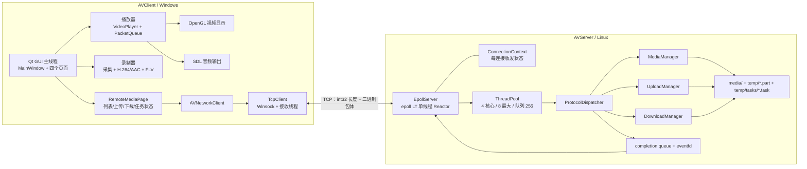
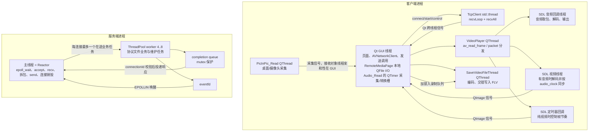

# AVProject 源码学习总计划

> 建立日期：2026-07-27  
> 源码基线：`d9de2ffb0cf5e2eb4c635c07965fb95faa9a155b`（工作区存在未提交文档，不以旧文档代替源码）  
> 主线工程：`AVClient/`、`AVServer/`

## 1. 加速学习模式（2026-07-27 起）

- 求职时间不足一个月，采用“讲授优先、项目逻辑优先、面试导向”，不再以逐题猜测和逐行源码分析为主。
- 教学权重：60% 项目架构、业务流程和技术原理；25% 设计取舍、异常与不足；15% 关键源码锚点、核心状态和线程归属。
- 学习者明确表示“不知道”时，直接讲解概念、项目用途、不采用的后果和面试表达，最后只用 1～3 题确认。
- 回答错误时直接指出并完整解释，只要求一次简短复述，不围绕非核心细节连续追问。
- 每课 45～70 分钟，只选择 3～8 个关键源码锚点。
- 每课最多 3 道快速检查：流程题、为什么题、异常题各至多一道。主要流程正确即可推进。
- 每阶段结束安排 15～20 分钟小型模拟面试。
- 面试题优先使用业务和技术语言，例如“拖动进度条后如何避免输出旧数据”，不假设面试官知道项目内部函数名；具体类和函数只作为回答后的源码证据或继续追问时的定位。
- 后续课程采用“常见面试问题 → 项目方案 → 为什么这样设计 → 异常与不足 → 必要源码锚点”的顺序，不围绕逐行代码组织课程。
- 首次出现且影响理解的关键代码字段，按需补充简短中文含义，例如 `ConnectionContext*（连接状态对象的指针）`、`send（把字节写入内核发送缓冲区）`；不为所有标识符机械翻译，避免增加阅读负担。
- 只阅读和分析业务源码、维护学习文档，不增加功能，不擅自重构 C++。
- 结论优先级：当前源码 > 构建文件 > 项目文档 > 历史/参考工程。

### 知识优先级

- A 级（面试必须掌握）：总体架构，播放/录制，媒体处理概念和同步，TCP/协议，epoll Reactor，非阻塞 I/O，动态线程池，eventfd/完成队列，上传下载与双向续传，并发、异常、不足与优化。
- B 级（理解作用）：核心类/函数/数据结构、生命周期、线程归属、智能指针、mutex/condition_variable、Packet/Frame/PTS/DTS/time_base。
- C 级（了解即可）：辅助函数、全部字段和常量、低频语法、非关键 UI、低价值内部细节。

## 2. 真实目录与主线边界

```text
AVProject/
├─ AVClient/                  当前 Windows Qt 客户端主线
│  ├─ main.cpp                客户端入口
│  ├─ MainWindow.*            顶层窗口、页面装配、共享网络对象
│  ├─ pages/                  Player / Recorder / Remote Media / Settings
│  └─ modules/
│     ├─ player/              FFmpeg 解封装/解码、SDL 音频、OpenGL 显示
│     ├─ recorder/            桌面/摄像头/麦克风采集、编码、FLV 封装
│     └─ network/             Winsock、协议编解码、传输状态持久化
├─ AVServer/                  当前 Linux 服务端主线
│  ├─ src/main.cpp            服务端入口
│  ├─ include/                核心类声明与协议
│  └─ src/                    Reactor、线程池和文件业务实现
├─ MediaPlayer/               原播放器参考/历史工程，不是当前入口
├─ VideoRecorder/             原录制器参考/历史工程，不是当前入口
├─ NetDisk-Client/            原网络客户端参考工程
├─ NetDisk-Server/            原网络服务端参考工程
└─ docs/                      项目说明、阶段日志和学习记录
```

`AVClient/AVClient.pro` 证明当前客户端实际编译的是 `AVClient` 下的页面和三个模块；第三方头文件、库仍从 `MediaPlayer/`、`VideoRecorder/` 的依赖目录引用，这不代表参考工程的业务源码参与主线运行。

## 3. 入口与核心模块地图

### 3.1 客户端

| 层次 | 文件 / 类 | 现阶段必须定位的函数 | 真实职责 |
|---|---|---|---|
| 入口 | `AVClient/main.cpp` | `main` | 初始化 SDL main、Qt、FFmpeg，创建 `MainWindow`，进入 Qt 事件循环 |
| 窗口装配 | `AVClient/MainWindow.*` / `MainWindow` | `MainWindow::MainWindow`、`slotPlayLocalFile` | 创建一个共享 `AVNetworkClient` 和四个页面；下载完成后切到播放器 |
| 页面 | `AVClient/pages/PlayerPage.*` | `PlayerPage::PlayerPage`、`playLocalFile` | 嵌入 `PlayerDialog` |
| 页面 | `AVClient/pages/RecorderPage.*` | `RecorderPage::RecorderPage` | 嵌入 `RecorderDialog` |
| 页面 | `AVClient/pages/RemoteMediaPage.*` | 构造函数、上传/下载各响应槽、`sendNextUploadBlock`、`requestNextDownloadBlock` | 远程列表、串行分片传输、本地任务持久化、下载后播放 |
| 页面 | `AVClient/pages/SettingsPage.*` | 构造函数、连接/断开/Ping 槽 | 服务器连接设置与 Ping |
| 网络门面 | `AVClient/modules/network/AVNetworkClient.*` | `send*`、`onPacketReceived` | 把业务请求转换成协议包，并把响应转换成 Qt 信号 |
| TCP | `AVClient/modules/network/TcpClient.*` | `connectToServer`、`sendPacket`、`sendAll`、`recvAll`、`recvLoop` | Winsock 连接；一个接收线程；长度帧收发 |
| 传输状态 | `UploadTaskStore.*`、`DownloadTaskStore.*` | `loadAll`、`save`、`remove` | 客户端未完成任务的本地持久化 |
| 播放控制 | `playerdialog.*` / `PlayerDialog` | `playLocalFile`、开始/暂停/停止/seek 槽 | UI 控制和播放状态显示 |
| 播放核心 | `videoplayer.*` / `VideoPlayer`、`VideoState` | `setFileName`、`run`、`seek`、`stop`、音视频回调/解码函数 | 解封装、队列分发、音视频解码和同步 |
| 播放队列 | `PacketQueue.*` | `packet_queue_init/put/get/flush/destroy` | 跨线程保存带引用的 `AVPacket` |
| 视频显示 | `myopenglwidget.*` / `MyOpenGLWidget` | `initializeGL`、`paintGL`、`slot_setImage` | 在 GUI 线程上传纹理并绘制 |
| 录制入口 | `recorderdialog.*` / `RecorderDialog` | `on_pb_start_clicked`、`on_pb_stop_clicked` | 组装录制参数并控制录制线程 |
| 录制核心 | `savevideofilethread.*` / `SaveVideoFileThread` | `slot_setInfo`、`run`、`write_*_frame`、`slot_closeVideo` | H.264/AAC 编码、时间戳比较、FLV 封装和文件输出 |
| 视频采集 | `picinpic_read.*` / `PicInPic_Read` | `run`、`slot_getVideoFrame`、`ImageToYuvBuffer` | 桌面与摄像头画中画、转换为 YUV420P |
| 音频采集 | `audio_read.*` / `Audio_Read` | `slot_openAudio`、`slot_readMore`、`slot_closeAudio` | `QAudioInput` 采集 PCM，重采样为编码所需格式 |

### 3.2 服务端

| 层次 | 文件 / 类 | 现阶段必须定位的函数 | 真实职责 |
|---|---|---|---|
| 入口 | `AVServer/src/main.cpp` | `main` | 解析端口，创建 `AVServer` |
| 外观 | `AVServer/src/AVServer.cpp` / `AVServer` | `start` | 转交给 `EpollServer::start` |
| Reactor | `EpollServer.*` / `EpollServer` | `start`、`acceptClients`、`handleRead`、`parseFrames`、`flushSendQueue`、`handleCompletionEvent` | 单线程管理 listen/client/eventfd、收发缓冲区和连接生命周期 |
| 连接状态 | `ConnectionContext.*` | 构造函数 | 每连接的接收缓冲、发送队列、唯一 connectionId 和在途业务标志 |
| 协议分发 | `ProtocolDispatcher.*` | `isBusinessPacket`、`dispatch`、各 `handle*` | 区分轻量协议与文件业务，调用管理器构造响应 |
| 线程池 | `ThreadPool.*` | `start`、`submit`、`workerLoop`、`stop`、`reapFinishedWorkers` | 4 个核心线程、最多 8 个线程、有界队列 256、非核心线程 60 秒回收 |
| 媒体目录 | `MediaManager.*` | `ensureMediaDir`、`buildMediaListPayload` | 扫描 `media/` 并生成列表载荷 |
| 上传状态 | `UploadManager.*` | `createUpload`、`resumeUpload`、`writeBlock`、`finishUpload`、恢复/持久化/清理函数 | 有状态上传、`.part`、`.task`、偏移校正和 72 小时过期清理 |
| 下载读取 | `DownloadManager.*` | `initializeDownload`、`readBlock`、`validateCompletion` | 校验文件元数据并按 offset 读取，服务端不保留下载会话 |
| 协议定义 | 两端 `av_protocol.h` | 全部 `STRU_*` 与 `DEF_PACK_*` | 4 字节主机字节序长度前缀之外的二进制包体；两份文件当前 SHA-256 相同 |

## 4. 总体架构图



设计主线：Qt 页面负责交互；播放器和录制器把持续、耗时处理移出 GUI 主循环；客户端网络门面屏蔽协议结构；服务端 Reactor 独占 socket、连接与认证状态，worker 执行 MySQL、Argon2id 和文件 I/O，结果只能经 completion queue + eventfd 回到 Reactor 入发送队列。

## 5. 主要线程模型



需要特别记住：

- `VideoPlayer`、`SaveVideoFileThread` 虽继承 `QThread`，其对象本身默认仍属于创建它的 GUI 线程；只有 `run()` 在新线程执行。
- 客户端上传/下载的 `QFile` 读写目前发生在 `RemoteMediaPage` 所在线程，即 GUI 线程；“网络 I/O 与文件业务解耦”主要指当前服务端架构。
- 服务端 worker 不持有 `ConnectionContext*`，任务只捕获 `connectionId`、当时的 fd、协议类型和包副本；完成时由 Reactor 再检查连接是否仍然有效。

## 6. 源码与概述文档的首轮差异

1. 阶段 11 已将登录占位替换为 MySQL + Argon2id 真实注册登录，并新增 AuthPage。认证状态绑定 ConnectionContext，断线即消失；当前仍没有长期 session、JWT、TLS 或复杂权限系统。
2. 服务端 `EpollServer::parseFrames` 使用 `ConnectionContext::receiveBuffer` 增量拆包；客户端 `TcpClient::recvLoop` 则用阻塞 `recvAll` 依次读满长度头和包体。两端都能应对 TCP 半包，但机制不同。
3. 服务端最大包体是 256 KiB，客户端接收校验上限是 1 MiB；当前 64 KiB 分片仍落在双方限制内，但限制值没有统一成共享协议常量。
4. 下载在服务端是无会话状态的按偏移读取；断点任务状态保存在客户端。上传任务则由服务端 `UploadManager` 持久化，二者不能混为同一种“服务端断点状态”。
5. 主线播放器/录制器业务代码已复制进 `AVClient/modules/`，参考工程只提供历史对照及第三方依赖路径，学习调用链必须从主线文件开始。
6. `VideoPlayer::setFileName` 内部已经调用 `start()`，但 `PlayerDialog::playLocalFile` 和打开 URL 的槽随后又调用一次 `m_player->start()`。第二次调用是当前源码中的冗余启动，不应解释成播放器需要启动两次；播放器专项课会把它作为真实缺陷分析。

## 7. 24 课压缩路线与预计投入

每课 45～70 分钟，预计正式课程约 18～28 小时；配合复述、画图、知识卡和模拟面试，总投入约 35～50 小时。

| 阶段 | 课数 | 核心产出 |
|---|---:|---|
| 1 项目整体架构 | 2 | 总体架构、启动/退出、30 秒与 2 分钟项目介绍 |
| 2 播放器 | 4 | 播放全流程、队列与线程、时间戳同步、控制/异常/不足 |
| 3 录制器 | 3 | 采集到 FLV、编码时间戳、停止/flush/当前缺陷 |
| 4 客户端网络与协议 | 3 | TCP 字节流、长度帧、协议门面、跨线程通知 |
| 5 epoll Reactor | 3 | listen/accept、LT 读写、连接状态与部分发送 |
| 6 动态线程池与跨线程协作 | 2 | 扩缩容、有界队列、completion queue + eventfd |
| 7 上传下载与断点续传 | 3 | 普通传输、双向恢复、状态与一致性边界 |
| 8 并发、异常、测试与不足 | 2 | 竞态、故障注入、安全边界、生产化差距 |
| 9 项目介绍与模拟面试 | 2 | 完整答辩结构和连续追问训练 |

每完成一个核心模块，在 `INTERVIEW_CARDS.md` 追加一张面试知识卡。

## 8. 当前进度

阶段1项目架构、阶段2播放器、阶段3录制器、阶段4客户端网络、阶段5 epoll Reactor、阶段6动态线程池/跨线程协作和阶段7双向断点续传已完成；播放器、录制器、Reactor、线程池/完成通知、断点续传达到L4，客户端网络达到L3。当前进入阶段8“并发、异常、测试与生产化边界”。Qt AutoConnection完整机制、客户端彻底异步化边界、粘包循环表述、陈旧结果双重确认链和哈希信任关系保留到最终模拟面试按需复查。
