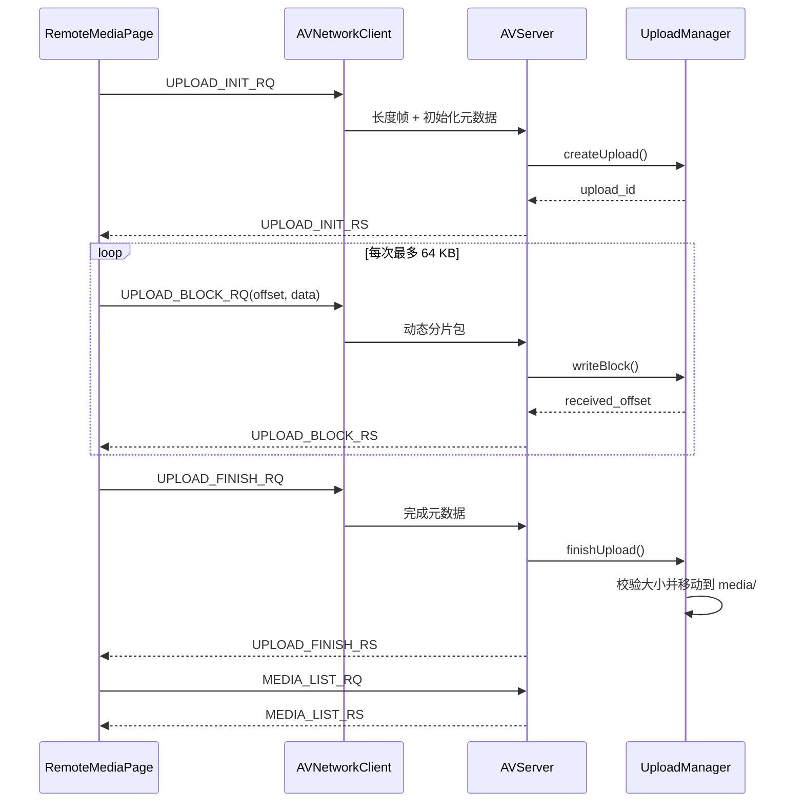

# 阶段 4：媒体文件分片上传

## 1. 本阶段目标

阶段 4 只打通“选择本地文件 -> 分片上传 -> 服务端落盘 -> 自动刷新媒体列表”的最小闭环。

本阶段不同时实现下载和远程播放，原因是上传本身已经涉及动态协议包、文件状态机、磁盘临时文件、进度确认和异常清理。先把单方向传输做稳定，可以更容易定位网络、协议和文件系统问题。下一阶段再复用相同的分片思想实现下载，并在下载完成后调用现有本地播放器。

本阶段没有实现“上传最近一次录制文件”或默认打开 recordings 目录的小优化。录制文件与普通媒体文件使用相同的手动选择上传入口。

## 2. 已完成功能

- Remote Media 页面新增手动选择并上传媒体文件的入口。
- 支持 `.mp4`、`.flv`、`.avi`、`.mkv`、`.mov`、`.wmv`、`.mp3`、`.aac`、`.wav`。
- 客户端按 64 KB 读取文件，不会把整个视频一次性载入内存。
- 实现 `UPLOAD_INIT`、`UPLOAD_BLOCK`、`UPLOAD_FINISH` 三阶段请求和响应。
- 每个分片收到服务端确认后才发送下一片，进度条依据服务端确认偏移更新。
- 上传期间禁用重复上传，成功或失败后恢复按钮。
- 未连接服务器时点击上传会提示先连接服务器。
- 服务端自动创建 `temp/` 和 `media/` 目录。
- 服务端对文件名、扩展名、包长、分片大小、offset 和最终文件大小进行检查。
- 未完成上传使用 `temp/<upload_id>.part` 保存，连接断开时清理当前临时任务。
- 上传完成后移动到 `media/`；同名文件自动保存为 `_1`、`_2` 等名字。
- 上传成功后客户端自动发送 `MEDIA_LIST_RQ` 并刷新列表。
- Ping、登录测试、媒体列表、本地播放和本地录制代码路径保持不变。

## 3. 新增文件清单

| 文件 | 作用 |
| --- | --- |
| `AVServer/include/UploadManager.h` | 定义上传任务、初始化、分片写入、完成和清理接口 |
| `AVServer/src/UploadManager.cpp` | 实现临时文件、白名单、路径检查、offset 校验、重名处理和文件移动 |
| `docs/stage_logs/STAGE4_UPLOAD_MEDIA.md` | 记录阶段 4 的设计、构建、测试、排错和面试问答 |

## 4. 修改文件清单

| 文件 | 修改原因 |
| --- | --- |
| `AVClient/modules/network/av_protocol.h` | 增加六种上传包类型及对应包结构 |
| `AVServer/include/av_protocol.h` | 与客户端保持完全一致的上传协议定义 |
| `AVClient/modules/network/AVNetworkClient.h` | 增加上传请求接口和上传响应信号 |
| `AVClient/modules/network/AVNetworkClient.cpp` | 组装动态 BLOCK 包，解析三类上传响应 |
| `AVClient/pages/RemoteMediaPage.h` | 增加上传状态、文件对象、进度控件和槽函数 |
| `AVClient/pages/RemoteMediaPage.cpp` | 实现文件选择、串行分片状态机、进度显示和成功后刷新 |
| `AVServer/include/AVServer.h` | 持有 `UploadManager` 并声明三类上传处理函数 |
| `AVServer/src/AVServer.cpp` | 分发上传协议、校验包体并返回响应 |
| `AVServer/Makefile` | 将 `src/UploadManager.cpp` 加入服务端构建 |

客户端没有新增独立 `.cpp` 文件，因此 `AVClient.pro` 本阶段不需要修改。

## 5. 核心类和函数

### 5.1 UploadManager

`UploadManager::createUpload()` 完成以下工作：

- 确保 `temp/` 和 `media/` 存在；
- 检查文件名不包含 `/`、`\` 和 `..`；
- 检查扩展名处于媒体白名单，且与文件名后缀一致；
- 生成由时间、进程号和递增序号组成的 `upload_id`；
- 创建空的 `temp/<upload_id>.part` 文件并记录任务。

`UploadManager::writeBlock()` 要求请求 offset 必须等于任务当前已接收大小。它拒绝空分片、超过 64 KB 的分片、越过声明总大小的分片和未知 `upload_id`。写入成功后返回新的 `received_offset`。

`UploadManager::finishUpload()` 同时比较协议声明大小、任务累计大小和磁盘文件实际大小。三者一致时，选择一个未占用的目标文件名，再把 `.part` 文件移动到 `media/`。

`UploadManager::abortAll()` 删除当前连接遗留的临时文件。当前服务端是单连接串行模型，因此断开客户端后统一清理符合本阶段范围。

### 5.2 RemoteMediaPage 上传状态机

页面保存当前文件、文件名、总大小、`upload_id`、已确认 offset 和本次期望确认 offset。

`slotUploadClicked()` 负责检查连接和后缀，打开 `QFile`，初始化 UI，然后发送 `UPLOAD_INIT_RQ`。

`sendNextUploadBlock()` 从当前已确认位置读取最多 64 KB。一次只保留一个 `QByteArray` 分片，发送后等待服务端响应。

`slotUploadBlockResponse()` 只接受与当前 `upload_id` 匹配、且 `received_offset` 恰好等于本次分片末尾的响应。确认后更新进度；未结束则通过零延迟 `QTimer` 把下一次读取交还事件循环调度。

`slotUploadFinishResponse()` 在成功时清理本地状态，并调用原有媒体列表刷新逻辑。

`finishUploadState()` 是成功、失败和断线的统一收尾入口，负责关闭文件、恢复按钮、更新状态和记录日志。

### 5.3 AVNetworkClient

`sendUploadInit()` 和 `sendUploadFinish()` 使用固定元数据结构。写入字符数组前检查 UTF-8 字节长度，避免静默截断。

`sendUploadBlock()` 创建：

```text
STRU_UPLOAD_BLOCK_RQ_HEADER + 当前分片字节
```

包体再交给现有 `TcpClient::sendPacket()`，由它添加 4 字节包长。上传没有改变底层 TCP 帧格式。

`onPacketReceived()` 新增三种响应分支，先严格检查结构大小，再复制结构并通过 Qt signal 把结果交给页面。原有 Ping、Login 和 Media List 分支不变。

### 5.4 AVServer

`handlePacket()` 根据包类型调用：

- `handleUploadInit()`
- `handleUploadBlock()`
- `handleUploadFinish()`

BLOCK 是动态包。服务端先复制固定头，再验证 `data_size` 位于 `1..65536`，并确认实际包长严格等于“头大小 + data_size”，最后才把数据指针传给 `UploadManager`。

## 6. 上传协议设计

### 6.1 为什么分成 INIT / BLOCK / FINISH

INIT 建立任务并提前拒绝非法元数据；BLOCK 负责可控内存的流式传输；FINISH 是提交动作，只有全部数据和大小校验通过后才让文件进入正式媒体目录。三段职责清晰，失败时不会把半成品暴露给媒体列表。

### 6.2 为什么不能一次发送整个视频

整文件包会同时占用文件大小级别的客户端内存、协议缓冲和服务端内存；现有收包层还设置了约 1 MB 的单包上限。视频越大，内存峰值、发送阻塞和失败重传成本越不可控。

### 6.3 为什么使用 64 KB 分片

64 KB 明显低于 1 MB 包长上限，单次内存占用小，又不会像极小分片那样产生过多协议往返。它不是理论最优值，而是第一版稳定性和实现复杂度之间的保守选择。

### 6.4 为什么需要 temp 目录

上传中断时文件不完整。如果直接写入 `media/`，媒体列表会展示无法播放的半成品。`temp/` 将“传输中状态”和“可用媒体状态”隔离开。

### 6.5 为什么完成后再移动到 media

移动操作是提交边界。只有总大小校验通过的文件才进入 `media/`，列表扫描看到的文件因此至少满足“传输完整”的条件。当前 `temp/` 与 `media/` 位于同一项目目录，重命名通常是同一文件系统内的原子操作。

### 6.6 如何避免路径穿越

服务端不信任客户端路径，只接收基本文件名，并拒绝 `/`、`\` 和 `..`。最终路径始终由服务端固定目录与已验证文件名拼接。客户端扩展名检查只改善体验，真正安全边界在服务端。

### 6.7 如何处理重名文件

如果 `media/test.mp4` 已存在，服务端依次尝试 `test_1.mp4`、`test_2.mp4`，直到找到未占用名称。FINISH 响应返回实际保存名，客户端日志展示该名称。

## 7. 上传流程



## 8. 构建方法

### 8.1 Windows 客户端

在 Qt 5.12.11 MinGW 7.3.0 32-bit 命令环境中：

```powershell
cd D:\colin\project\AVProject\AVClient
mkdir build-debug
cd build-debug
D:\Software\Qt\5.12.11\mingw73_32\bin\qmake.exe ..\AVClient.pro -spec win32-g++ "CONFIG+=debug"
D:\Software\Qt\Tools\mingw730_32\bin\mingw32-make.exe -j4
```

输出程序为 `AVClient/bin/AVClient.exe`。

### 8.2 Ubuntu 服务端

```bash
cd AVProject/AVServer
make clean
make
./AVServer 8000
```

启动成功后应打印 `media directory` 和 `upload temp directory`。

## 9. 测试方法

1. Ubuntu 执行 `make clean && make && ./AVServer 8000`。
2. Windows 启动 `AVClient/bin/AVClient.exe`，在设置页连接 `192.168.44.130:8000`。
3. 先验证 Ping 和 Remote Media 刷新，再选择一个 `.mp4` 或 `.flv` 上传。
4. 观察进度到 100%，确认服务端打印 INIT、BLOCK、FINISH 和保存路径日志。
5. 确认文件出现在 `AVServer/media/`，客户端列表自动出现实际保存名。
6. 回归本地播放和本地录制。

自动验证结果：Windows 客户端已通过完整编译，并通过隐藏启动 5 秒的冒烟测试。当前 Windows 环境没有 WSL Linux 发行版，Ubuntu 服务端构建和双端真实上传需要在虚拟机中人工完成。

## 10. 常见问题与排查

### 上传前未连接服务器

上传按钮会提示先连接。到设置页确认 IP、端口和 Connected 状态，再用 Ping 验证协议链路。

### 文件扩展名不支持

客户端文件框和服务端都使用九种后缀白名单。仅修改客户端过滤器无法绕过服务端检查，两端协议头也应同步。

### temp 目录不存在

服务端启动和首次初始化都会尝试创建 `temp/`。若失败，检查 AVServer 当前工作目录和写权限。

### media 目录权限不足

确认运行用户对 AVServer 工作目录具有创建、写入和重命名权限。可用 `ls -ld media temp` 检查。

### 上传过程中连接断开

客户端结束当前状态并恢复按钮；服务端在连接处理结束后删除活动 `.part` 文件。本版需要重新从头上传。

### 上传完成但列表未刷新

检查客户端日志是否收到成功的 `UPLOAD_FINISH_RS`，随后是否发送 `MEDIA_LIST_RQ`。也可手动点击 Refresh media list 区分上传问题和刷新问题。

### 文件名重名

这是正常情况。服务端会生成 `_1`、`_2` 名称，FINISH 响应和刷新后的列表显示实际文件名。

### 大文件上传看起来卡顿

确认服务端持续打印 BLOCK offset，且进度在增加。本版每块等待一次确认，吞吐优先级低于稳定性；虚拟机网络、磁盘同步写和控制台大量日志也会影响速度。

### Ping 功能回退

确认客户端与服务端 `av_protocol.h` 完全一致，并检查服务端是否仍能打印 `received PING_RQ`。上传包类型只追加在原类型之后，不应改变 Ping 数值。

### 媒体列表功能回退

先检查 `media/` 是否存在及文件后缀是否在白名单，再观察 `MEDIA_LIST_RQ/RS` 日志。上传完成刷新复用阶段 3 的原接口。

## 11. 本阶段未做内容

- 文件下载
- 下载后远程媒体播放
- 删除和手动重命名
- 断点续传
- MD5、SHA-256 等内容校验
- 秒传
- 多文件并发上传
- 用户权限和配额
- MySQL 文件索引
- 上传最近录制文件的快捷入口

## 12. 下一阶段建议

下一阶段实现远程文件下载：

1. 在 Remote Media 列表选择一行并发送下载初始化请求。
2. 服务端按块读取 `media/` 中的文件并返回。
3. 客户端写入 `AVClient/cache/<name>.part`。
4. 完成大小校验后改名为正式缓存文件。
5. 调用现有播放器打开本地 cache 文件。

这样可形成“录制或选择文件 -> 上传 -> 远程列表 -> 下载 -> 本地播放”的完整业务闭环，同时避免第一版自定义 TCP 边下边播带来的 seek、缓冲和音视频同步复杂度。

## 13. 面试问答准备

### Q1：为什么上传协议分为 INIT、BLOCK、FINISH？

INIT 用来协商和验证元数据，并创建服务端任务；BLOCK 只负责传输一段数据；FINISH 负责最终校验和提交。这样失败发生在哪个阶段很清楚，而且半成品一直留在 temp，不会被媒体列表误认为可播放文件。这个设计也方便以后给 INIT 增加用户、配额和断点信息，给 FINISH 增加哈希校验。

### Q2：为什么不一次性发送整个视频？

视频可能是几百 MB 甚至数 GB。整文件读入内存会让客户端、网络包和服务端同时承受文件大小级别的内存峰值，也超过项目当前 1 MB 的单包限制。分片后内存复杂度接近 O(block_size)，失败时也能明确知道处理到了哪个 offset。

### Q3：为什么选择 64 KB？

它远低于当前最大包长，内存开销固定，同时比几 KB 的小块减少了请求响应次数。64 KB 是工程折中，不是固定真理。后续可以通过局域网测试调整，或者引入滑动窗口，在保持有限内存的同时提升吞吐。

### Q4：为什么需要 temp 目录？

网络随时可能中断，上传中的文件不是完整媒体。temp 把“正在传输”与“已经可用”分开：列表只扫描 media，异常任务只清理 temp。这样服务端即使崩溃，也不会把明显的 `.part` 文件当成正式媒体。

### Q5：为什么上传完成后才移动到 media？

移动相当于事务的提交点。FINISH 前先比较声明大小、累计接收大小和磁盘实际大小，全部一致才改名进入 media。同一文件系统内的 rename 通常是原子的，因此媒体列表看到的是旧状态或完整新文件，不容易看到中间状态。

### Q6：项目如何解决 TCP 粘包和半包？

TCP 是字节流，没有消息边界。项目给每个协议包增加 4 字节包长。接收方先用 `readExact/recvAll` 读满长度字段，再校验长度范围，然后继续读满包体。无论一次 recv 得到半个包、一个包还是多个包的一部分，上层最终都按完整帧处理。

### Q7：BLOCK 为什么还要携带 offset？

只有 data 而没有 offset 时，双方只能默认状态永远同步。显式 offset 让服务端能拒绝重复块、跳块和乱序块。本版要求 offset 严格等于 `receivedSize`，实现串行传输；以后扩展断点续传时，同一个字段可以表示恢复位置。

### Q8：进度条为什么使用服务端确认偏移，而不是客户端已读取字节？

客户端读到内存或调用 send 成功，只代表数据进入了本机发送流程，不代表服务端已经落盘。用 `UPLOAD_BLOCK_RS.received_offset / file_size` 计算进度，语义是“服务端已确认写入比例”，比本地读取进度更可信。

### Q9：如何避免路径穿越？

不能相信客户端传来的路径。服务端只接受基本文件名，拒绝 `/`、`\` 和 `..`，并由服务端自己拼接固定的 temp/media 根目录。后续更严格的版本还可以使用 `openat`、目录文件描述符和 `O_NOFOLLOW` 防止符号链接相关攻击。

### Q10：如何处理同名文件？

服务端不覆盖原文件，而是拆分 basename 和 suffix，依次尝试 `_1`、`_2`。实际保存名通过 FINISH 响应返回。当前服务器串行处理客户端，检查与 rename 之间没有并发竞争；未来多线程版本应使用原子创建或数据库唯一约束解决竞态。

### Q11：上传中断后当前版本会怎样？

客户端收到断线事件后关闭本地文件并恢复按钮。服务端退出当前连接处理后调用 `abortAll()` 删除活动 `.part` 文件。因此不会污染 media，但用户必须重新从零上传。这是“失败清理”，不是“断点恢复”。

### Q12：为什么当前方案还不算断点续传？

虽然协议有 upload_id 和 offset，但任务只存在服务端内存中，断线后会被删除；客户端也没有持久化文件指纹和已确认位置。真正断点续传需要任务持久化、重新连接后的查询或恢复协议、文件身份校验、临时文件保留策略和超时清理。

### Q13：后续如何扩展断点续传？

INIT 可以携带文件大小、修改时间和内容哈希，服务端查询已有任务并返回 resume_offset。客户端从该位置继续读；服务端要持久化 upload_id、临时路径和已写范围。若允许乱序或并行块，还要记录 bitmap/range，并在 FINISH 时验证所有区间完整。

### Q14：当前串行 ACK 上传的优缺点是什么？

优点是状态简单：任意时刻最多一个未确认块，offset 容易校验，内存固定，错误定位直观。缺点是每 64 KB 都要等待一个网络往返，带宽延迟积较大时吞吐下降。后续可允许固定数量的在途块，用滑动窗口兼顾速度和内存。

### Q15：客户端如何避免一次上传阻塞整个流程？

文件按 64 KB 分次读取，并且每次收到服务端响应后通过 Qt 事件循环调度下一块，所以不会出现一次读取整个视频造成的长时间内存和 CPU 占用。当前底层 `sendAll` 仍是同步发送，局域网第一版以简单稳定为主；若面向高延迟或不可靠网络，应进一步把发送队列放入专用网络线程并设置发送超时。

### Q16：如何验证上传文件真的完整？

当前实现验证三种大小：INIT 声明的总大小、服务端累计确认的字节数、temp 文件的 `stat` 实际大小。这能发现缺块和明显截断，但不能发现“长度相同、内容损坏”。生产方案应再增加 SHA-256 等内容哈希，MD5 可用于误码检测但不适合作为安全校验。

### Q17：上传流程与网盘上传有什么相似和不同？

相似点是都有初始化任务、分片、进度、完成提交和临时文件。不同点是本项目当前是单连接串行、无登录鉴权、无秒传、无分片并发、无任务持久化和对象存储；它更像一个教学用最小媒体上传通路。设计上借鉴了网盘的协议分层，但业务只围绕媒体管理。

### Q18：如果将服务端升级为 epoll + 线程池，UploadManager 要注意什么？

当前 map 和重名检查默认串行访问。多连接后需要按任务加锁或将任务绑定到 worker，发送响应也要处理非阻塞 socket 的部分写。磁盘 I/O 不应在 epoll 事件线程里长时间执行；可把文件写入投递给线程池，并确保同一 upload_id 的块按 offset 有序提交。
