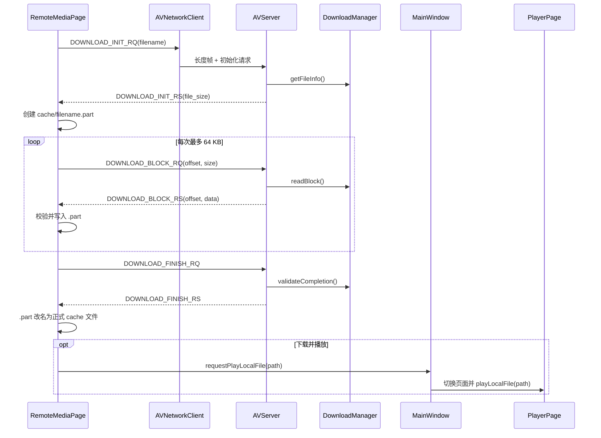

# 阶段 5：远程媒体下载与本地播放

## 1. 本阶段目标

阶段 5 实现“远程列表选择文件 -> 分片下载到本地 cache -> 完整后调用现有播放器”的闭环。

本阶段选择下载后播放，而不是自定义 TCP 边下边播。完整下载后，播放器面对的仍是普通本地文件，已有的 FFmpeg 解封装、seek、音视频同步、SDL 音频和 OpenGL 渲染逻辑都可以原样复用。边下边播则需要处理缓存不足、随机 seek、阻塞读取、重连和自定义 `AVIOContext`，会把文件传输与播放器核心同时变复杂，不符合当前“先形成最小可运行系统”的目标。

## 2. 本阶段完成的功能

- Remote Media 列表支持单选远程媒体。
- 新增“Download file”和“Download and play”按钮。
- 显示当前选中文件、下载状态和服务端确认进度。
- 实现 `DOWNLOAD_INIT`、`DOWNLOAD_BLOCK`、`DOWNLOAD_FINISH` 三阶段协议。
- 服务端每次最多读取 64 KB，不会一次加载完整媒体。
- 客户端逐块写入 `AVClient/cache/<filename>.part`。
- 下载完成后校验本地大小，再替换正式 cache 文件。
- 下载并播放完成后自动切换到 Player 页面并播放本地文件。
- 中断或失败时删除 `.part`，恢复上传和下载按钮。
- 上传与下载互斥，第一版不允许同时执行多个传输任务。
- Ping、媒体列表、上传、录制和本地播放原有流程保持可用。

## 3. 新增文件清单

| 文件 | 作用 |
| --- | --- |
| `AVServer/include/DownloadManager.h` | 定义远程文件检查、分块读取和完成校验接口 |
| `AVServer/src/DownloadManager.cpp` | 实现路径防护、普通文件检查、64 KB 分块读取和文件大小校验 |
| `docs/stage_logs/STAGE5_DOWNLOAD_AND_PLAY.md` | 记录阶段 5 的设计、构建、排查和面试问答 |

## 4. 修改文件清单

| 文件 | 修改原因 |
| --- | --- |
| `AVClient/modules/network/av_protocol.h` | 增加六种下载包类型和数据结构 |
| `AVServer/include/av_protocol.h` | 与客户端保持完全一致的下载协议 |
| `AVClient/modules/network/AVNetworkClient.h/.cpp` | 发送三类下载请求，解析固定和动态下载响应 |
| `AVClient/pages/RemoteMediaPage.h/.cpp` | 增加选择、下载 UI、cache 写入、进度和下载状态机 |
| `AVClient/modules/player/playerdialog.h/.cpp` | 把现有本地文件播放流程封装为安全 public slot |
| `AVClient/pages/PlayerPage.h/.cpp` | 向主窗口暴露 `playLocalFile()` |
| `AVClient/MainWindow.h/.cpp` | 转发播放请求、切换到 Player 页面 |
| `AVServer/include/AVServer.h` | 持有 `DownloadManager` 并声明下载处理函数 |
| `AVServer/src/AVServer.cpp` | 分发 INIT/BLOCK/FINISH 并构造动态分片响应 |
| `AVServer/Makefile` | 将 `DownloadManager.cpp` 加入服务端构建 |

客户端没有新增独立源文件，因此 `AVClient.pro` 不需要增加条目。

## 5. 核心类和函数

### 5.1 DownloadManager

`getFileInfo()` 验证文件名不包含 `/`、`\` 或 `..`，检查扩展名白名单，并通过 `stat` 确认目标是 `media/` 下的非空普通文件。

`readBlock()` 再次执行文件检查，然后校验：

- `offset >= 0` 且小于文件大小；
- `request_size` 位于 `1..65536`；
- 最后一块不越过文件末尾。

函数使用 `ifstream::seekg()` 定位，只把本次请求的数据放入 `vector<char>`。

`validateCompletion()` 在 FINISH 阶段重新获取服务端文件大小，与客户端声明的已下载大小比较。它用于发现下载期间服务端文件被替换或大小发生变化。

### 5.2 RemoteMediaPage 下载状态机

`startDownload()` 检查连接和列表选择，记录“只下载”或“下载并播放”模式，再发送 INIT。

收到 INIT 成功响应后，页面创建 `AVClient/cache/` 和 `.part` 文件。cache 路径根据程序目录 `AVClient/bin/` 的上一级计算，因此调试输出仍落在项目的 `AVClient/cache/`。

`requestNextDownloadBlock()` 从 offset 0 开始，每次请求剩余大小和 64 KB 中的较小值。收到一个响应并成功写盘后才请求下一块。

`slotDownloadBlockResponse()` 验证文件名、offset、数据长度和总大小边界，写入成功后才更新进度。

`slotDownloadFinishResponse()` 检查 `.part` 实际大小，删除旧 cache 同名文件，将 `.part` 改名为正式文件，再按用户选择决定是否发出播放信号。

`finishDownloadState()` 统一处理成功、失败和断线：关闭文件、失败时删除 `.part`、清理状态并恢复按钮。

### 5.3 AVNetworkClient

`sendDownloadInit()`、`sendDownloadBlock()` 和 `sendDownloadFinish()` 使用现有 `TcpClient::sendPacket()`，因此线上格式仍是：

```text
4 字节包长 + 下载协议包体
```

BLOCK 请求是固定元数据；BLOCK 响应由固定头和动态数据组成：

```text
STRU_DOWNLOAD_BLOCK_RS_HEADER + data_size 字节
```

解析响应时先校验固定头，再校验 `data_size <= 64 KB` 且实际包长完全匹配。格式错误也会向页面发出失败信号，避免页面永久停留在下载状态。

### 5.4 AVServer

`handleDownloadInit()` 查询文件信息并返回文件名和总大小。

`handleDownloadBlock()` 验证固定请求结构，调用 `DownloadManager::readBlock()`，再拼接动态响应头和本次文件数据。

`handleDownloadFinish()` 记录完成日志，并确认服务端当前文件大小仍与客户端下载大小一致。

### 5.5 PlayerPage::playLocalFile()

`PlayerPage` 只负责把路径转给 `PlayerDialog`。`PlayerDialog::playLocalFile()` 检查目标存在且为普通文件，停止旧任务，然后调用原有：

```text
VideoPlayer::setFileName()
VideoPlayer::start()
```

FFmpeg 解码、音视频同步和渲染逻辑没有修改。

### 5.6 MainWindow 页面转发

`RemoteMediaPage` 不持有 `PlayerPage` 指针，而是发出：

```cpp
requestPlayLocalFile(filePath)
```

`MainWindow::slotPlayLocalFile()` 接收后切换 `QTabWidget` 当前页面，并调用 `PlayerPage::playLocalFile()`。这使 Remote Media 只表达业务意图，页面导航仍由主窗口负责。

## 6. 下载协议设计

### 6.1 为什么需要 INIT / BLOCK / FINISH

INIT 先确认文件存在并获得可信总大小；BLOCK 按 offset 传输有限数据；FINISH 表示客户端已完整接收，并让服务端记录和复核。三阶段让错误位置清楚，也为以后加入下载任务 ID、统计和断点续传保留扩展点。

### 6.2 为什么不能一次发送整个视频

完整视频可能远大于当前 1 MB 单包限制。一次读取还会在服务端、TCP 包体和客户端同时产生文件大小级内存占用。分片后两端内存都稳定在约一个 block。

### 6.3 为什么使用 64 KB

它明显低于现有最大协议包长，又不会产生过多小包。当前每块都等待一次响应，64 KB 是第一版稳定性、进度粒度和往返次数之间的折中。

### 6.4 为什么写入 cache

cache 将远程资源转换为播放器已支持的本地文件，也避免每次播放都重复下载。下载中的文件使用 `.part`，正式 cache 只包含已经完成大小校验的文件。

### 6.5 为什么先完整下载再播放

播放器可以正常读取文件尾部索引、执行 seek，并使用原有同步逻辑。传输失败也只影响下载任务，不会把网络等待传播进解码线程。

### 6.6 如何避免路径穿越

服务端只接收基本文件名，拒绝路径分隔符和 `..`，并固定从 `media/` 拼接路径。客户端在创建 cache 前再次检查响应文件名，防止服务端异常响应写到 cache 之外。

### 6.7 如何验证完整性

当前验证 INIT 总大小、累计写入 offset、每块边界、本地 `.part` 实际大小和 FINISH 时服务端实际大小。它能发现缺块和截断，但不能发现等长内容损坏；后续应增加 SHA-256 或 MD5。

## 7. 下载与播放流程



## 8. 构建方法

Windows 客户端：

```powershell
cd D:\colin\project\AVProject\AVClient\build-debug
D:\Software\Qt\5.12.11\mingw73_32\bin\qmake.exe ..\AVClient.pro -spec win32-g++ "CONFIG+=debug"
D:\Software\Qt\Tools\mingw730_32\bin\mingw32-make.exe -j4
```

Ubuntu 服务端：

```bash
cd AVProject/AVServer
make clean
make
./AVServer 8000
```

## 9. 测试方法

1. Ubuntu 启动服务端，并确认 `media/` 中至少有一个受支持媒体。
2. Windows 启动客户端，连接 `192.168.44.130:8000` 并刷新列表。
3. 选择一行，分别测试 Download file 和 Download and play。
4. 确认进度到 100%、`AVClient/cache/` 文件大小正确，后一种模式会切换并播放。
5. 回归 Ping、上传、本地播放和录制。

自动验证：Windows 客户端已通过全量构建；唯一警告是原有 FFmpeg 4.2 `av_register_all()` 弃用提示。当前环境没有 Ubuntu/WSL，因此服务端 `make` 和真实双端下载由 Ubuntu 虚拟机完成人工验收。

## 10. 常见问题与排查

### 未连接服务器

按钮会提示先连接。先到 Settings 页确认 Connected，并用 Ping 排除基础网络问题。

### 未选择远程文件

下载按钮会提示先选择。确认列表中整行已高亮，Selected 标签显示了文件名。

### 服务端文件不存在

列表刷新后文件可能被手动删除。重新刷新；检查服务端 INIT 日志和 `AVServer/media/`。

### cache 目录不存在

客户端会自动创建 `AVClient/cache/`。失败通常是项目目录无写权限或被安全软件拦截。

### cache 文件大小不一致

检查是否中途断线、服务端文件是否在下载期间变化，以及 BLOCK offset 是否连续。失败任务的 `.part` 会被清理。

### 下载过程中连接断开

本版删除 `.part` 并从零重试，不保留断点。重新连接后重新下载。

### 下载完成但无法播放

先在 Player 页手动打开 cache 文件。如果仍失败，检查文件本身编码格式、播放器日志和 FFmpeg 是否支持该封装/编码。

### 播放页没有自动切换

确认点击的是 Download and play，并检查下载是否收到成功的 FINISH 响应。普通 Download file 不会自动切换。

### 上传功能回退

确认上传和下载当前没有任务占用；两种传输第一版互斥。再检查上传 INIT/BLOCK/FINISH 日志。

### 媒体列表功能回退

确认没有正在传输，连接正常，然后手动刷新。检查 `MEDIA_LIST_RQ/RS` 和服务端 media 目录权限。

## 11. 本阶段未做内容

- TCP 边下边播
- FFmpeg 自定义 `AVIOContext`
- HLS/RTMP 推拉流
- 断点续传
- 多任务或并行下载
- 内容哈希校验
- 删除和重命名
- MySQL 文件索引

## 12. 下一阶段建议

- 录制完成后快捷上传最近录制文件。
- 抽取统一传输任务状态，优化上传/下载取消和错误展示。
- 增加 SHA-256 或 MD5 完整性校验。
- 增加服务端媒体删除协议。
- 整理根 README、架构图、运行截图和简历项目描述。

## 13. 面试问答准备

### Q1：为什么选择下载后播放，而不是边下边播？

下载后播放把网络传输和解码完全解耦。播放器拿到的是完整本地文件，现有 seek、文件尾索引、音视频同步和错误处理都能直接工作。边下边播会让 FFmpeg 的读取操作依赖网络缓存，必须处理缺数据阻塞、随机 seek、重连和缓存淘汰。项目当前目标是先完成可靠业务闭环，所以选择复杂度更低、可验证性更强的方案。

### Q2：什么是 FFmpeg 自定义 AVIOContext，为什么暂时不做？

`AVIOContext` 是 FFmpeg 的自定义 I/O 抽象，可以提供自己的 read、seek 等回调，让 FFmpeg 从内存、私有协议或网络缓存读取数据。若用于 TCP 边下边播，read 回调必须在数据不足时正确阻塞或返回，seek 还要映射到远程范围请求。处理不当会造成解封装失败、线程卡死或无法拖动，因此不适合在最小版本里仓促加入。

### Q3：下载为什么也分 INIT、BLOCK、FINISH？

INIT 解决“文件是否存在、总大小是多少”；BLOCK 解决“从哪个 offset 获取多少数据”；FINISH 表示客户端认为任务完整，并让服务端记录或复核。分阶段后协议职责清晰，后续可以在 INIT 返回 download_id，在 FINISH 增加哈希、下载统计或权限审计。

### Q4：项目如何解决 TCP 粘包和半包？

TCP 只提供连续字节流。项目在每个业务包前放 4 字节包长，接收端先循环读满长度，再验证它不超过 1 MB，最后循环读满对应包体。这样一次 recv 无论得到半包、整包还是多个包的一部分，都不会破坏上层消息边界。

### Q5：为什么使用 cache 目录？

cache 是远程媒体到本地播放器之间的稳定边界。它允许播放器按普通文件方式工作，也允许用户之后手动重播，不必重新请求服务器。下载过程使用 `.part`，只有完整任务才变成正式 cache 文件，避免残缺文件被误播放。

### Q6：为什么 `.part` 完成后才改名？

文件名本身可以表达状态：`.part` 是不可用的传输中数据，正式文件名是已通过大小检查的数据。改名相当于客户端提交动作。断线时只需删除 `.part`，旧的正式 cache 也不会在下载过程中被写成半截。

### Q7：为什么不能一次把整个视频读入内存？

视频大小不可控，一次读取会造成服务端和客户端的高内存峰值，也超过现有单包上限。64 KB 分块让内存占用近似常量，并且每块都有 offset，错误能定位到具体传输位置。

### Q8：如何保证下载文件与服务端大小一致？

客户端先记录 INIT 返回的总大小；每个 BLOCK 必须从当前 offset 开始，且不能越过总大小；写完后检查 `.part` 的磁盘实际大小；FINISH 时服务端再次比较当前媒体文件大小。多层大小检查能发现缺块和截断，但内容级完整性仍需要哈希。

### Q9：为什么进度使用已写入字节，而不是已请求字节？

发出请求不代表数据已收到，收到数据也不代表成功写盘。当前进度按“成功校验并写入 cache 的累计字节 / INIT 总大小”计算，所以 100% 表示客户端磁盘已经拥有全部字节，语义更准确。

### Q10：如何防止路径穿越？

服务端不接受完整路径，只接受基本文件名，并拒绝 `/`、`\` 和 `..`，最终路径由固定 `media/` 根目录拼接。客户端也验证响应文件名后才拼接 cache 路径。安全规则必须以服务端为准，客户端检查只是第二层防御。

### Q11：下载途中断线会怎样？

客户端收到断线信号后关闭文件、删除 `.part`、清理状态并恢复按钮。因为本阶段没有持久化下载任务，重连后从 offset 0 重新开始。这个策略浪费部分已传数据，但行为简单且不会误用不完整 cache。

### Q12：当前方案为什么不算断点续传？

虽然 BLOCK 有 offset，但断线后客户端会删除 `.part`，服务端也没有 download_id、任务状态或恢复查询协议。断点续传不仅需要 offset，还需要确认“本地残留文件与服务端当前文件是同一个版本”，否则可能把两个版本拼在一起。

### Q13：如何扩展为断点续传？

客户端保留 `.part` 和元数据，例如文件名、总大小、已写 offset、服务端版本标识或哈希。重新 INIT 时携带本地状态，服务端确认文件版本并返回可恢复 offset。客户端还要校验本地 `.part` 大小，必要时通过分块哈希确认前缀内容一致。

### Q14：为什么第一版采用串行请求，而不是服务端主动连续推送？

串行模式任意时刻只有一个未完成块，客户端天然形成背压：磁盘写完才请求下一块。它不需要复杂的发送队列、乱序重排和内存水位控制。代价是每块都承担一个往返时延，后续可用滑动窗口提高吞吐。

### Q15：RemoteMediaPage 如何调用播放器而不产生强耦合？

Remote Media 只发出 `requestPlayLocalFile(path)` 信号，不直接持有 PlayerPage。MainWindow 作为页面管理者接收信号、切换标签页，再调用 PlayerPage。这样下载页面不知道具体导航结构，播放器也不知道文件来自远程下载。

### Q16：为什么没有重写播放器核心？

阶段 1 的播放器已经能稳定播放本地文件。阶段 5 只新增 `playLocalFile()` 外部入口，内部仍调用原来的 `VideoPlayer::setFileName()` 和 `start()`。保持解码和同步逻辑不变能缩小回归范围，也体现模块复用能力。

### Q17：如果服务端文件在下载中被替换会怎样？

当前每次 BLOCK 都重新 `stat` 并打开文件，FINISH 也检查大小。如果文件大小改变，通常会在边界或 FINISH 失败；但等长替换无法仅靠大小发现。更可靠的设计应在 INIT 固定文件版本，例如 inode、mtime 和 SHA-256，并让后续请求携带 download_id。

### Q18：阶段 5 完成后形成了什么业务闭环？

项目已经具备本地录制和播放、客户端服务器通信、服务端媒体列表、客户端分片上传、远程分片下载以及下载后播放。可以演示“产生媒体 -> 上传管理 -> 查看远程列表 -> 下载缓存 -> 本地播放”的完整 C/S 音视频流程，同时服务端保留协议分发和后续扩展空间。
